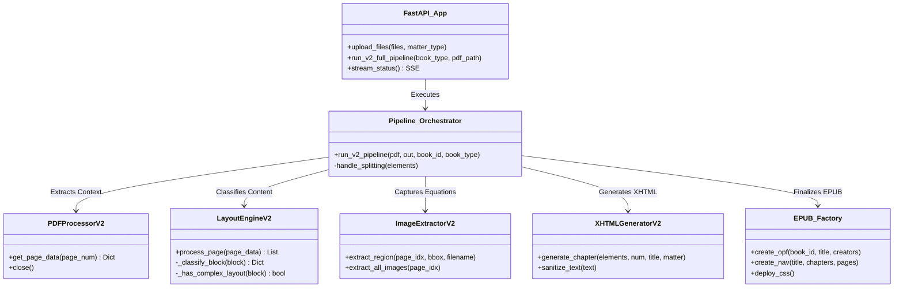
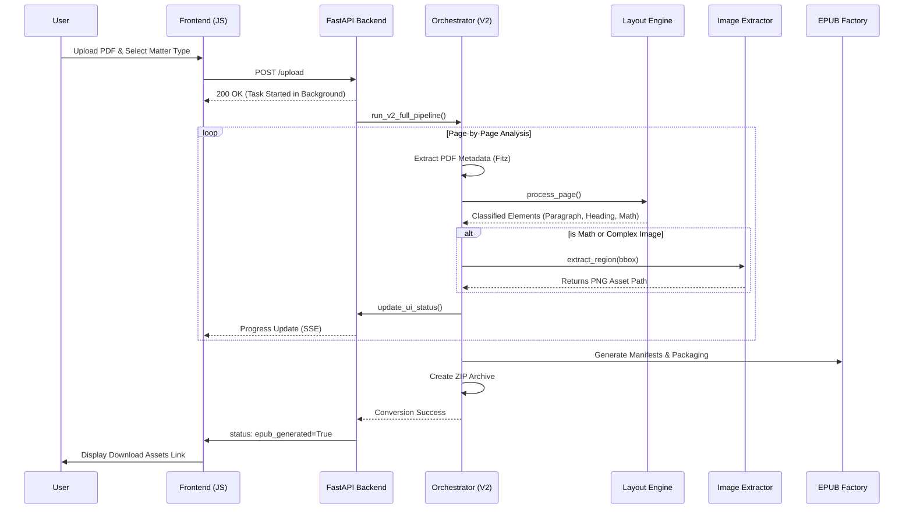
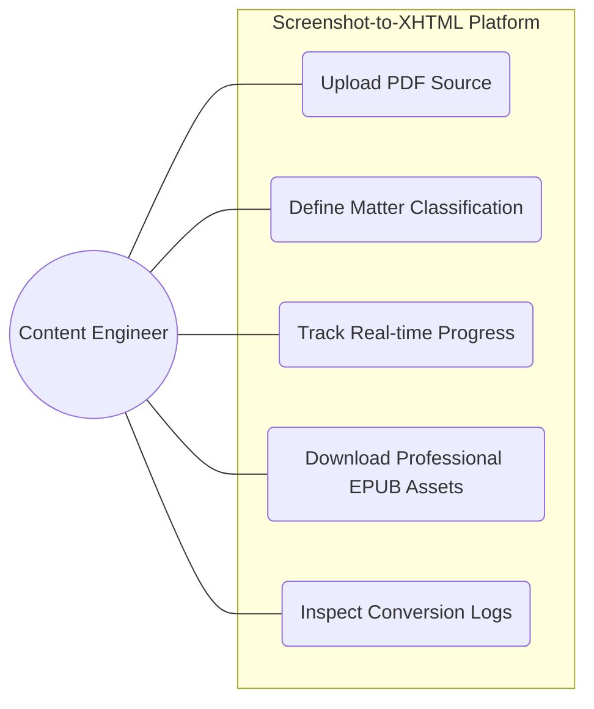
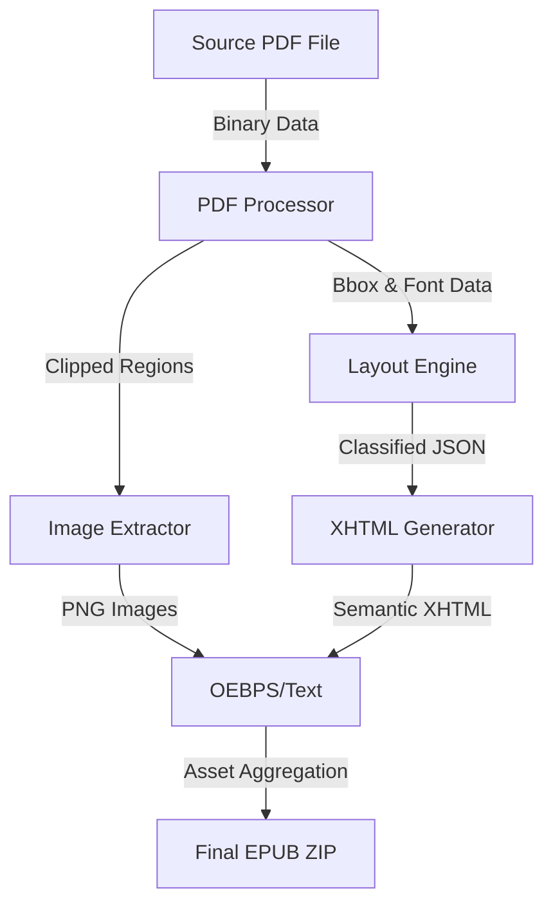

# Screenshot-to-XHTML AI System - Complete Project Analysis

## 1. Aim & Proposed System
The **Screenshot-to-XHTML AI System** is designed to solve the challenge of converting complex, highly formatted PDF documents (such as mathematical textbooks and academic journals) into high-quality, reflowable **EPUB 3.0** assets. 

While standard conversion tools often fail with mathematical formulas and intricate layouts, this system proposes a **Visual-First Classification** methodology. By treating complex regions as images and standard text as reflowable XHTML, it ensures 100% visual fidelity for technical content while maintaining the accessibility and searchability of a digital book.

---

## 2. Architecture

### Technology Stack
| Layer | Technology |
| :--- | :--- |
| **Frontend** | HTML5, CSS3, Vanilla JavaScript (SSE for Progress) |
| **Backend** | FastAPI, Python 3.10+ |
| **PDF Processing** | PyMuPDF (fitz) |
| **Generation** | Jinja2, BeautifulSoup4, lxml |
| **Image Processing** | Pillow (PIL) |
| **Orchestration** | Python Asyncio & Background Tasks |

### Project Structure
```text
screenshot-to-xhtml-ai-system/
├── ui/
│   ├── app.py              # FastAPI application & SSE status management
│   ├── pipeline_status.py   # Global state for real-time progress updates
│   └── templates/          # Jinja2 UI templates (index.html, dashboard.html)
├── v2_system/
│   ├── run_v2.py           # Core Pipeline Orchestrator & Splitting Logic
│   ├── core/
│   │   ├── pdf_processor.py # Direct PDF data extraction using Fitz
│   │   └── layout_engine.py # Visual-first classification logic
│   ├── generator/
│   │   ├── xhtml_generator.py # Semantic XHTML builder (Chapter-level)
│   │   └── epub_factory.py   # EPUB packaging (OPF, NAV, CSS, Containers)
│   └── utils/
│       └── image_extractor.py # Precise coordinate-based region cropping
├── data/                   # Input and Output file storage
├── config/                 # System configuration & client-specific styling rules
└── requirements.txt        # Backend dependencies
```

---

## 3. Visual Architecture & UML Diagrams

### 3.1 Class Diagram (System Structure)
This diagram illustrates the modular design and the relationships between the processing components.



### 3.2 Sequence Diagram (Process Flow)
The step-by-step lifecycle of a conversion task, from initial upload to the final ZIP bundle.



### 3.3 Use Case Diagram (User Interactions)
Primary use cases for the conversion specialist using the platform.



### 3.4 Data Flow Diagram (Level 0)
Visualizes how data transforms from a binary PDF into a structured EPUB asset.



---

## 4. Detailed Component Analysis

### 4.1 Layout Engine (Visual-First Classification)
The core intelligence of the system. It avoids common OCR errors by using geometric analysis:
- **Centering Detection**: Centered blocks with mathematical symbols are automatically treated as display equations.
- **Indentation Analysis**: Distinguishes between new paragraphs and indented mathematical proofs.
- **Complexity Heuristics**: If a block contains overlapping lines or high variance in X-positions, it is extracted as a single image to preserve the exact layout (tables, diagrams).

### 4.2 Pipeline Logic & Splitting
- **Dynamic File Creation**: The system monitors heading hierarchy and matter type (Front, Body, Back) to automatically split the document into appropriately sized XHTML files for better EPUB performance.
- **Deduplication**: A bounding-box cache ensures that identical visual elements (like logos or repeated symbols) are only extracted once, reducing the final file size.

### 4.3 EPUB Generation & Standards
- **EPUB 3.0 Compliance**: Generates standard-compliant `content.opf` and `nav.xhtml` files.
- **Accessibility**: Injects `epub:type="pagebreak"` and `role="doc-pagebreak"` to ensure the digital book maps accurately to its print counterpart.
- **Styling**: Deploys a specialized `cup.css` that handles mathematical image alignment and standard book typography.

---

## 5. Operational Features ✅
- **4x Zoom Extraction**: Images are extracted at 4x the PDF resolution to ensure clarity on high-density displays (Kindle, iPad).
- **UTF-8 Integrity**: Every stage of the pipeline enforces UTF-8 encoding, preventing corruption of special characters.
- **Auto-Cleanup**: The system proactively manages temporary storage, clearing previous run artifacts to ensure every output is pristine.
